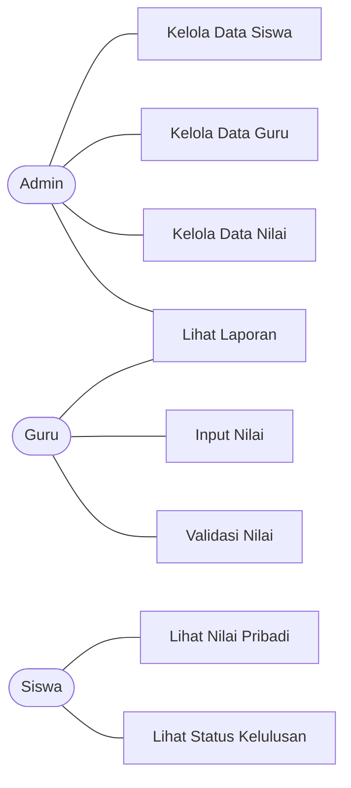
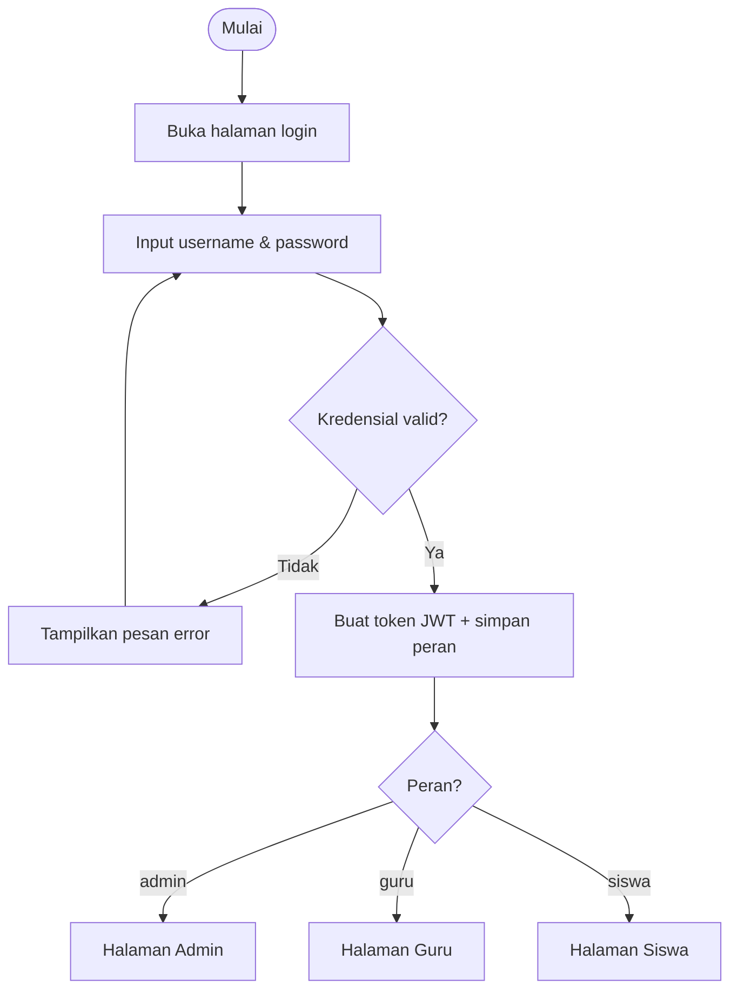
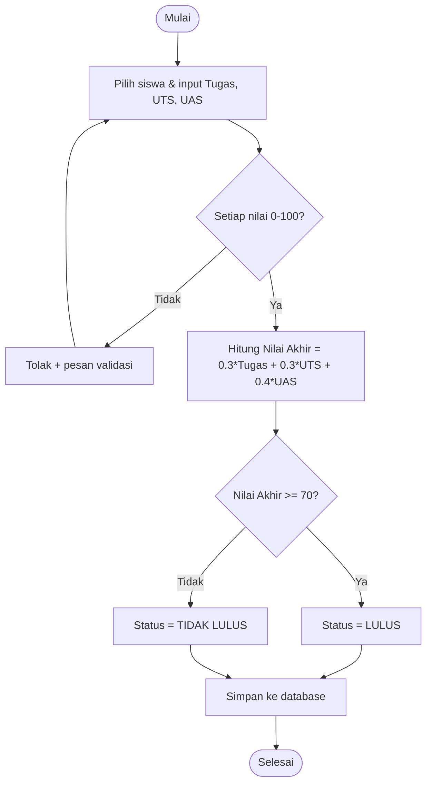
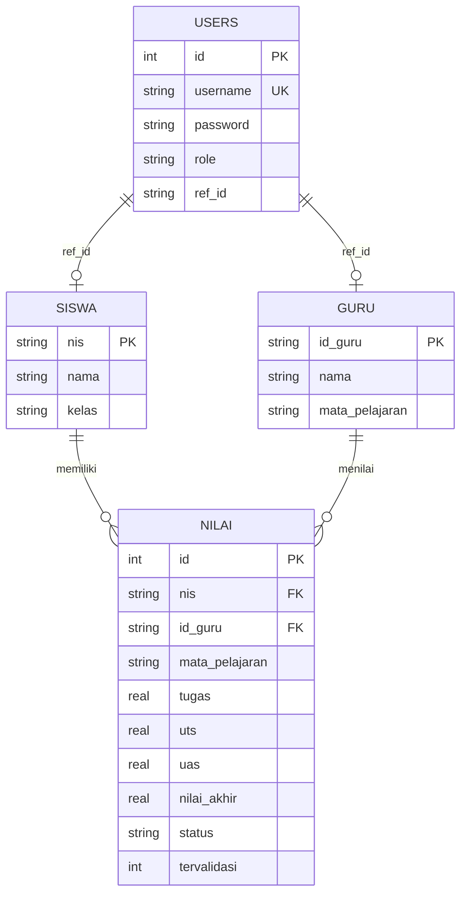
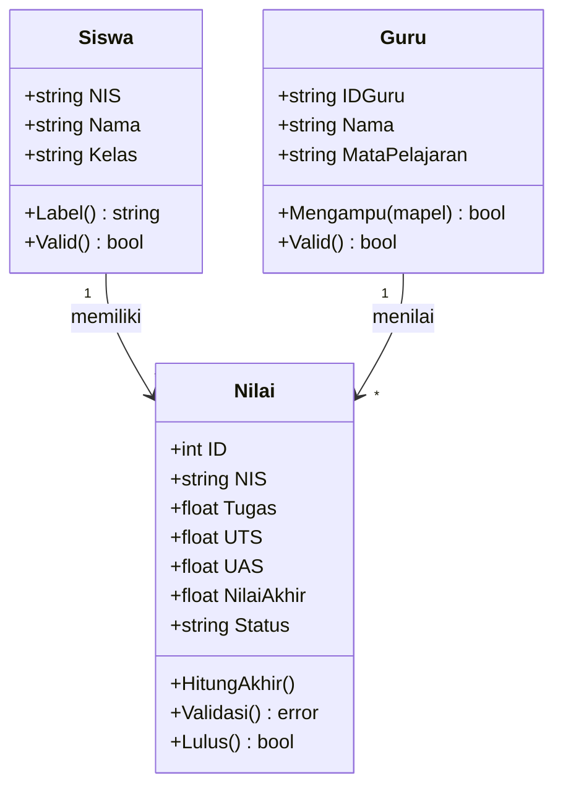

# TUGAS 1 — Analisis dan Perancangan Sistem

**Aplikasi Pengolahan Nilai Siswa** · Skema Programmer

---

## 1. Tujuan Sistem

Membangun aplikasi berbasis komputer yang membantu institusi pendidikan
mengelola nilai siswa secara **cepat, rapi, dan terstruktur**, mulai dari
pengelolaan data siswa, input nilai, perhitungan nilai akhir secara otomatis,
penentuan status kelulusan, hingga penyajian laporan hasil belajar.

Tujuan khusus:

1. Menyimpan dan mengelola data siswa, guru, dan nilai.
2. Menghitung nilai akhir secara otomatis dan konsisten.
3. Menentukan status kelulusan berdasarkan ketentuan yang baku.
4. Menyajikan laporan hasil belajar.
5. Membatasi akses fitur sesuai peran pengguna (admin, guru, siswa).

---

## 2. Analisis Kebutuhan Pengguna

| Pengguna  | Kebutuhan                                                                                  |
| --------- | ------------------------------------------------------------------------------------------ |
| **Admin** | Mengelola seluruh data (CRUD siswa, guru, nilai) dan melihat laporan.                      |
| **Guru**  | Menginput nilai siswa, melihat rekap nilai, dan memvalidasi nilai sesuai mata pelajaran.   |
| **Siswa** | Melihat nilai pribadi dan status kelulusan.                                                |

### Use Case ringkas



---

## 3. Fungsi Utama Sistem

1. **Autentikasi & otorisasi** — login berdasarkan peran (JWT).
2. **Manajemen data siswa** — tambah, lihat, ubah, hapus.
3. **Manajemen data guru** — tambah, lihat, ubah, hapus.
4. **Manajemen nilai** — input nilai, perhitungan nilai akhir otomatis, validasi.
5. **Penentuan kelulusan** — otomatis berdasarkan nilai akhir.
6. **Laporan** — rekap jumlah lulus/tidak lulus, rata-rata, nilai tertinggi/terendah.

---

## 4. Spesifikasi Fungsional & Nonfungsional

### 4.1 Kebutuhan Fungsional (KF)

| Kode | Deskripsi                                                                  |
| ---- | -------------------------------------------------------------------------- |
| KF-1 | Sistem dapat melakukan login dan membedakan peran admin/guru/siswa.        |
| KF-2 | Sistem dapat menyimpan, menampilkan, mengubah, dan menghapus data siswa.   |
| KF-3 | Sistem dapat mengelola data guru.                                          |
| KF-4 | Sistem dapat menginput dan mengelola nilai (Tugas, UTS, UAS).              |
| KF-5 | Sistem memvalidasi nilai pada rentang 0–100.                               |
| KF-6 | Sistem menghitung nilai akhir = 30% Tugas + 30% UTS + 40% UAS.             |
| KF-7 | Sistem menentukan status LULUS (≥70) / TIDAK LULUS.                        |
| KF-8 | Sistem menampilkan laporan hasil belajar.                                  |
| KF-9 | Siswa hanya dapat melihat nilai miliknya sendiri.                          |

### 4.2 Kebutuhan Nonfungsional (KNF)

| Kode  | Deskripsi                                                                 |
| ----- | ------------------------------------------------------------------------- |
| KNF-1 | **Keamanan** — password disimpan ter-hash (bcrypt); akses dibatasi token. |
| KNF-2 | **Usability** — antarmuka sederhana berbahasa Indonesia.                  |
| KNF-3 | **Portabilitas** — database SQLite (tanpa server terpisah).               |
| KNF-4 | **Reliability** — validasi input mencegah data tidak valid tersimpan.     |
| KNF-5 | **Maintainability** — kode terbagi per modul/package yang jelas.          |

---

## 5. Alur Kerja Sistem

### 5.1 Alur Login



### 5.2 Alur Input & Perhitungan Nilai



---

## 6. Rancangan Antarmuka (UI)

Aplikasi memakai layout **sidebar + konten**. Menu menyesuaikan peran.

### 6.1 Halaman Login

```
┌───────────────────────────────┐
│            🎓                  │
│   Pengolahan Nilai Siswa       │
│   Silakan masuk sesuai peran   │
│                                │
│   Username [______________]    │
│   Password [______________]    │
│        [     Masuk     ]       │
│                                │
│   Akun demo (klik mengisi):    │
│   [ Admin — admin/admin123 ]   │
│   [ Guru  — guru/guru123   ]   │
│   [ Siswa — siswa/siswa123 ]   │
└───────────────────────────────┘
```

### 6.2 Halaman Admin / Guru (contoh: Data Nilai)

```
┌─────────────┬──────────────────────────────────────────────┐
│  🎓 Nilai   │ [ADMIN]                      👤 admin  [Keluar]│
│  Siswa      ├──────────────────────────────────────────────┤
│             │  Data Nilai                                    │
│ Dashboard   │  ┌── Input Nilai Baru ────────────────────┐   │
│ Data Siswa  │  │ Siswa[▼] Mapel[__] Guru[▼]             │   │
│ Data Guru   │  │ Tugas[__] UTS[__] UAS[__]  [Simpan]    │   │
│ Data Nilai  │  └────────────────────────────────────────┘   │
│ Laporan     │  Rekap Nilai                                   │
│             │  Nama | Mapel | T | U | A | Akhir | Status     │
│             │  Ahmad| MTK   |80 |75 |90 | 82.5  | LULUS  ... │
└─────────────┴──────────────────────────────────────────────┘
```

### 6.3 Halaman Siswa (Nilai Saya)

```
┌──────────────────────────────────────────────┐
│ 🎉 Selamat! Anda LULUS pada semua mapel.       │
├──────────────────────────────────────────────┤
│ Mata Pelajaran | Tugas | UTS | UAS | Akhir | St│
│ Matematika     |  80   | 75  | 90  | 82.5  |LLS│
└──────────────────────────────────────────────┘
```

---

## 7. Rancangan Database

### 7.1 Entity Relationship Diagram (ERD)



### 7.2 Spesifikasi Tabel

**Tabel `siswa`**

| Kolom | Tipe | Keterangan          |
| ----- | ---- | ------------------- |
| nis   | TEXT | Primary Key (unik)  |
| nama  | TEXT | Nama siswa          |
| kelas | TEXT | Kelas siswa         |

**Tabel `guru`**

| Kolom          | Tipe | Keterangan         |
| -------------- | ---- | ------------------ |
| id_guru        | TEXT | Primary Key        |
| nama           | TEXT | Nama guru          |
| mata_pelajaran | TEXT | Mapel yang diampu  |

**Tabel `nilai`**

| Kolom          | Tipe    | Keterangan                                 |
| -------------- | ------- | ------------------------------------------ |
| id             | INTEGER | Primary Key (auto increment)               |
| nis            | TEXT    | Foreign Key → siswa(nis), ON DELETE CASCADE|
| id_guru        | TEXT    | Foreign Key → guru(id_guru)                |
| mata_pelajaran | TEXT    | Mata pelajaran                             |
| tugas          | REAL    | Nilai tugas (0–100)                        |
| uts            | REAL    | Nilai UTS (0–100)                          |
| uas            | REAL    | Nilai UAS (0–100)                          |
| nilai_akhir    | REAL    | Hasil perhitungan otomatis                 |
| status         | TEXT    | LULUS / TIDAK LULUS                         |
| tervalidasi    | INTEGER | 0 = belum, 1 = sudah divalidasi guru       |

**Tabel `users`** (autentikasi)

| Kolom    | Tipe    | Keterangan                          |
| -------- | ------- | ----------------------------------- |
| id       | INTEGER | Primary Key                         |
| username | TEXT    | Unik                                |
| password | TEXT    | Hash bcrypt                         |
| role     | TEXT    | admin / guru / siswa                |
| ref_id   | TEXT    | NIS (siswa) atau ID guru (guru)     |

> Definisi skema diimplementasikan pada `backend/internal/database/database.go`
> (fungsi `Migrate`).

---

## 8. Batasan Sistem

1. Aplikasi berjalan pada lingkungan lokal (localhost).
2. Database menggunakan SQLite (single-file), bukan untuk skala besar/multiuser tinggi.
3. Satu siswa dapat memiliki banyak nilai (per mata pelajaran).
4. Nilai yang valid hanya pada rentang 0–100.
5. Manajemen akun (registrasi user baru) dilakukan melalui seeding awal, bukan form publik.

---

## 9. Rancangan Fungsi/Prosedur & Class/Method

### 9.1 Pemrograman Terstruktur — Fungsi/Prosedur (minimal 3)

Diimplementasikan di `backend/internal/services/nilai_service.go` dan
`backend/internal/laporan/laporan.go`:

| No | Fungsi/Prosedur                                | Tujuan                                         |
| -- | ---------------------------------------------- | ---------------------------------------------- |
| 1  | `ValidasiNilai(label, nilai) error`            | Memvalidasi nilai pada rentang 0–100.          |
| 2  | `HitungNilaiAkhir(tugas, uts, uas) float64`    | Menghitung nilai akhir (30/30/40).             |
| 3  | `TentukanStatusKelulusan(nilaiAkhir) string`   | Menentukan LULUS / TIDAK LULUS.                |
| 4  | `BuatLaporan(daftar) Laporan`                  | Mengolah daftar nilai menjadi ringkasan.       |

### 9.2 OOP — Class & Method (minimal 2)

Diimplementasikan di `backend/internal/models/`:



**Integrasi kedua pendekatan:** method OOP `Nilai.HitungAkhir()` dan
`Nilai.Validasi()` **memanggil** fungsi terstruktur `HitungNilaiAkhir`,
`TentukanStatusKelulusan`, dan `ValidasiSemuaNilai`. Dengan begitu OOP dan
pemrograman terstruktur saling mendukung dalam satu aplikasi.

---

## 10. Bukti Koneksi Database Berhasil

Saat backend dijalankan, koneksi SQLite berhasil dibuat (log terminal):

```
koneksi database berhasil -> nilai_siswa.db
database kosong, mengisi data awal (seeding)...
seeding selesai (akun: admin/admin123, guru/guru123, siswa/siswa123)
server berjalan di http://localhost:8080
```

Implementasi koneksi: fungsi `Connect()` pada
`backend/internal/database/database.go` menggunakan `sql.Open("sqlite", dsn)`
dilanjutkan `db.Ping()` untuk memastikan koneksi valid.

---

## Output Tugas 1 — Ceklist

- [x] Dokumen spesifikasi program (dokumen ini)
- [x] Flowchart / UML sistem (bagian 2, 5, 9)
- [x] Rancangan database (bagian 7)
- [x] Desain antarmuka aplikasi (bagian 6)
- [x] Koneksi database berhasil (bagian 10)
- [x] Rancangan fungsi/procedure dan class/method (bagian 9)
